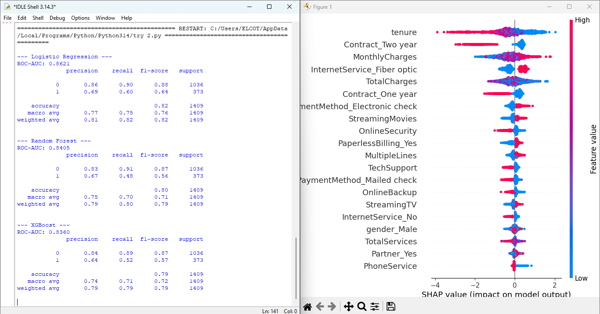

# Project 1: Customer Churn Prediction
This project uses classification algorithms to predict which customers are likely to leave a service.

### Key Features:
* Data Preprocessing and Cleaning
* Exploratory Data Analysis (EDA)
* Model Training with Random Forest
* Visualization of Results

### Results:

