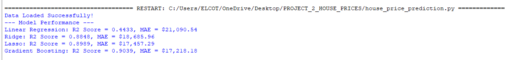

# Project 2: House Price Prediction
This project predicts real estate prices using various regression techniques and feature engineering.

### Key Steps:
* **Feature Engineering:** Handled missing values and encoded categorical variables.
* **Model Comparison:** Evaluated Linear Regression, Ridge, Lasso, and Gradient Boosting.
* **Best Model:** Gradient Boosting with an R2 Score of 0.9039.

### Performance Results:

