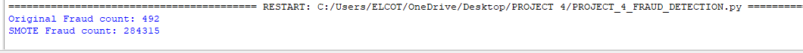

# Project 4: Credit Card Fraud Detection
This project focuses on identifying fraudulent transactions using Machine Learning, specifically addressing the challenge of **Imbalanced Data**.

## 📌 Problem Statement
In real-world fraud data, the number of fraudulent transactions is tiny compared to legitimate ones. This "imbalance" makes it hard for AI to learn. 

## ⚙️ Methodology: SMOTE
To solve this, I used **SMOTE** (Synthetic Minority Over-sampling Technique). Instead of just copying the fraud data, SMOTE creates "synthetic" examples to help the model recognize fraud patterns more effectively.

## 📁 Dataset
Due to GitHub's file size limitations, the dataset is not uploaded here. 
You can download the **Credit Card Fraud Detection** dataset from Kaggle:
[Link to Dataset on Kaggle](https://www.kaggle.com/datasets/mlg-ulb/creditcardfraud)

### Results of Data Balancing:
* **Initial Fraud Samples:** 492
* **Balanced Fraud Samples:** 284,315 (via SMOTE)

## 🛠️ Tech Stack
* **Language:** Python 3.14
* **Libraries:** Pandas, Scikit-learn, Imbalanced-learn (SMOTE)
* **Model:** Logistic Regression
