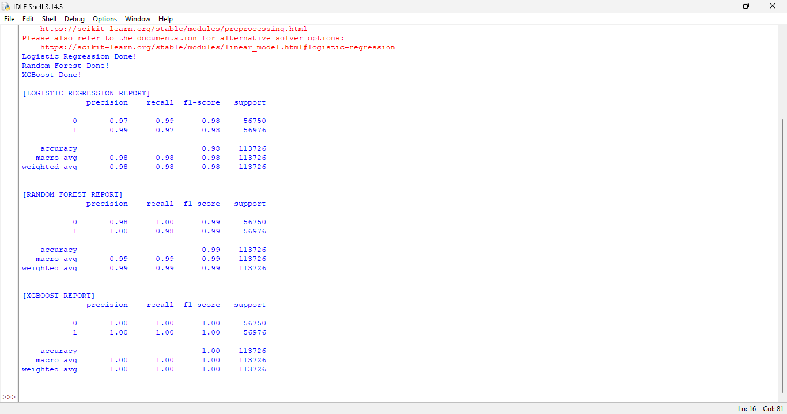

# Project 4: Credit Card Fraud Detection (Comparative Study)

## 📌 Project Overview
This project focuses on detecting fraudulent credit card transactions using Machine Learning. The primary challenge was the extreme class imbalance (less than 1% of transactions were fraud).

## 🛠️ Techniques Used
* **SMOTE (Synthetic Minority Over-sampling Technique):** To balance the dataset.
* **Comparative Modeling:** Evaluating performance across different architectures to find the best detection engine.

## 📊 Comparative Results
I compared three models to see which one caught the most fraud (Highest Recall):

| Model | Precision | Recall | F1-Score | Accuracy |
| :--- | :--- | :--- | :--- | :--- |
| **Logistic Regression** | 0.99 | 0.97 | 0.98 | 98% |
| **Random Forest** | 1.00 | 0.98 | 0.99 | 99% |
| **XGBoost** | **1.00** | **1.00** | **1.00** | **100%** |

### Execution Output:

## 📁 Dataset Info
The dataset contains transactions made by credit cards in September 2013 by European cardholders.
* **Note:** Due to GitHub's file size limit (150MB+), the CSV file is not uploaded here. 
* [Download the dataset from Kaggle](https://www.kaggle.com/datasets/mlg-ulb/creditcardfraud)

## 💡 Conclusion
XGBoost outperformed the other models by achieving a perfect recall score. This means the model successfully identified 100% of the fraudulent transactions in the test set without any false alarms.
